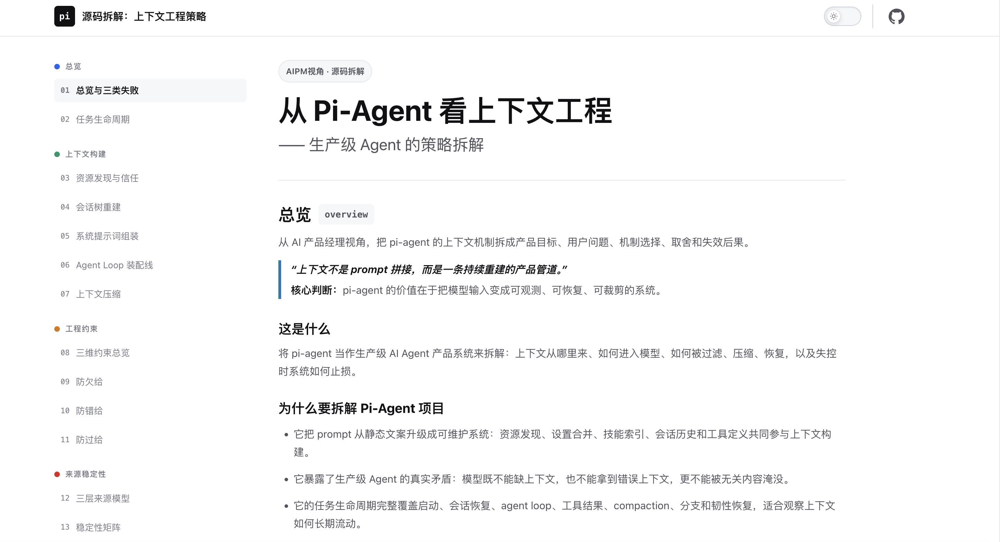
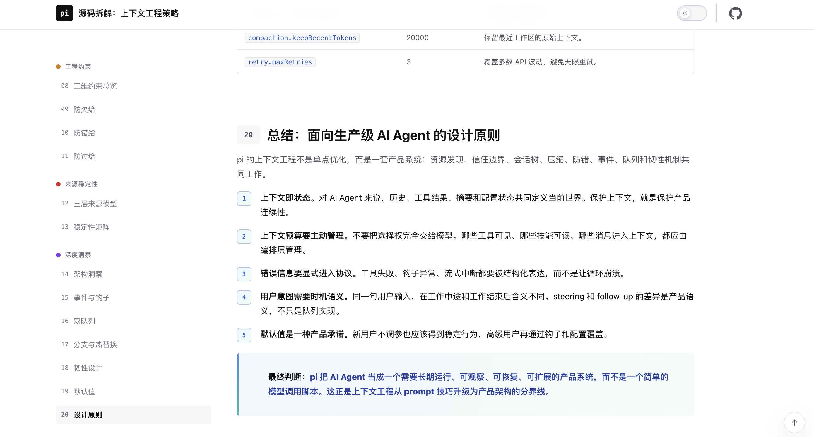

# Context Engineering Analysis: How Pi-Agent Builds Production-Grade Agent Context

> A systematic teardown of [Pi-Agent](https://github.com/earendil-works/pi-mono)'s context engineering — analyzed from an AI Product Manager's perspective, focusing on how context is built, constrained, and stabilized throughout an agent's lifecycle.

## 🎯 What Is This

An interactive analysis that treats Pi-Agent as a production AI product and answers:

- How does context flow through a single task, from startup to completion?
- What are the three fundamental tensions in context engineering (under-supply, wrong-supply, over-supply)?
- How does a production Agent decide what the model should see at each turn?

## 📐 Analysis Dimensions

| # | Module | Core Question |
|---|--------|---------------|
| 01 | Overview | Context engineering ≠ prompt concatenation. What are the three fundamental tensions? |
| 02 | Lifecycle | How does context flow through a single task? |
| 03 | Startup | How are resources discovered in layers? Where are the trust boundaries? |
| 04 | Session Tree | Why isn't context a linear chat log? |
| 05 | System Prompt | What does the largest single-text assembly do? |
| 06 | Agent Loop | How does the per-turn assembly line work? |
| 07 | Compaction | How is history compressed without losing recoverability? |
| 08 | 3D Constraints | How do under-supply, wrong-supply, and over-supply prevention coexist? |
| 09 | Source Stability | What are the three-layer source model and stability matrix? |
| 10 | Deep Insights | Architecture, resilience mechanisms, and default value strategies |

## 🛠 Tech Stack

- Pure HTML / CSS / JavaScript, zero build dependencies
- [Mermaid.js](https://mermaid.js.org/) — Architecture diagrams
- CDN-loaded, single-file deployment
- Responsive layout with dark mode support

## 🔗 Live Demo

[View Online →](http://pi-analysis.xuyh.site)

## 📸 Screenshots

---
