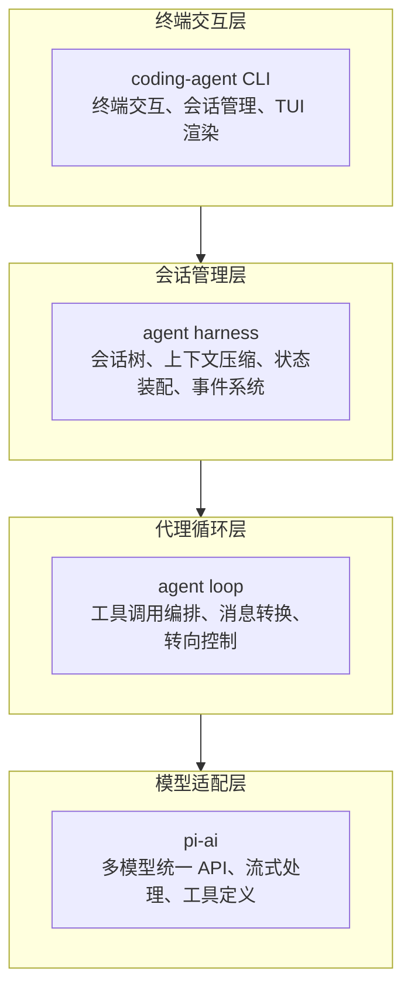
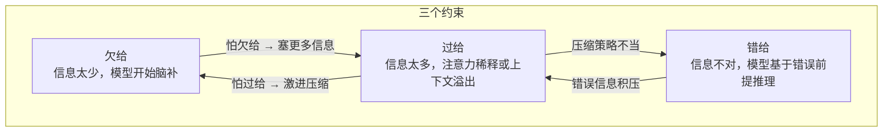
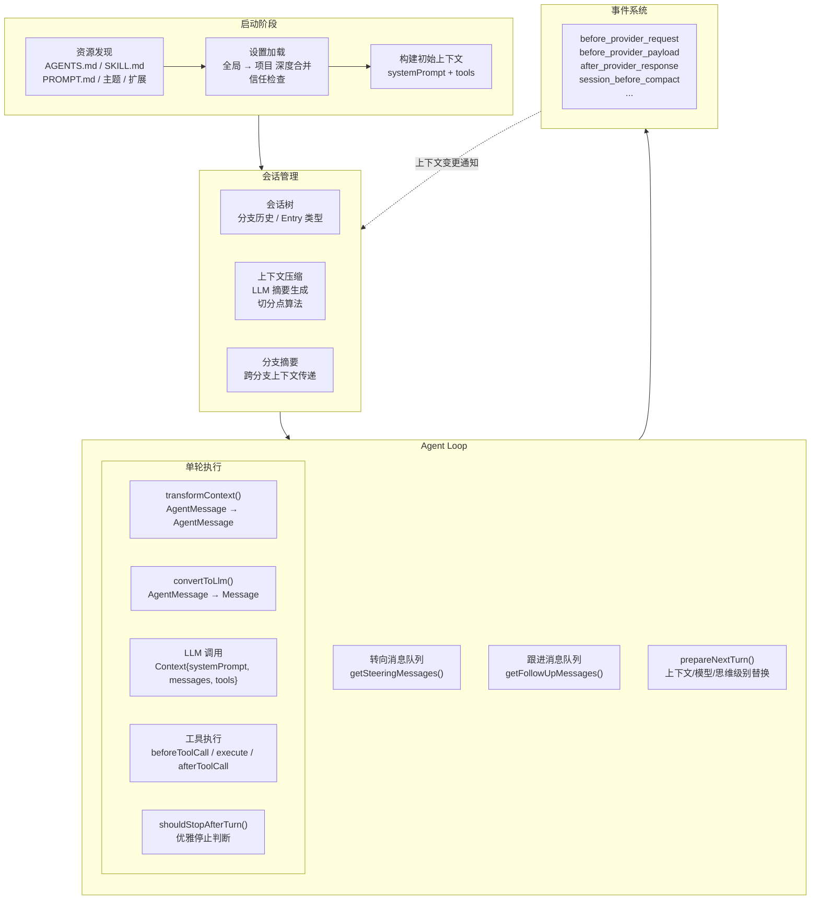

# pi 上下文工程策略分析 — 文档 1：概述与架构总览

> 写作视角：产品经理 | 核心问题：pi 如何构建、管理和约束 LLM 的上下文？

---

## 1. pi 是什么

pi 是一个 AI 编码代理工具包，核心命题是：**把正确的信息，在正确的时间，以正确的形式，喂给正确的大模型。**

pi 的系统分为四层：

上下文工程的核心逻辑集中在中间两层：agent loop 负责每次模型调用的上下文装配，agent harness 负责跨轮次的会话演进与压缩。

---

## 2. 上下文工程的三个基础矛盾

上下文工程本质是在管理三个互相拉扯的约束：

| 问题 | 原因 | 后果 |
|------|------|------|
| **欠给** | 模型缺少判断所需的信息——编码规范、工作目录、历史决策 | 凭空编造 API、代码风格冲突、忽略用户约束 |
| **错给** | 给的信息本身错误——工具定义和实际能力不匹配、文件内容过时 | 模型基于错误前提做出正确推理，结果全错，排查困难 |
| **过给** | 大量无关文件、完整对话历史、全部工具一次性塞入 | 超出上下文窗口导致截断（关键信息丢失）、注意力稀释、延迟增加 |

三者会互相触发。怕欠给而塞入所有文件 → 导致过给。过激压缩想解决过给 → 丢失关键信息，同时引发欠给和错给。

---

## 3. 架构全景：上下文流经的每一站

信息从进入系统到发送给模型，经过多个加工站：

关键洞察：**上下文不是启动时一次性构建的，是一条持续流动的管道。** 每次模型调用的上下文都可能不同——中间修改了文件、执行了工具、用户插话了、或发生了压缩。

---

## 4. 上下文的核心概念模型与四大控制机制

pi 将每次模型调用需要知道的内容收敛为三个要素（在代码中统称为 `AgentContext`）：

| 要素 | 类型 | 说明 |
|------|------|------|
| systemPrompt | 文本 | 角色定义、工具列表、技能索引、行为准则、当前日期和目录 |
| messages | 消息数组 | 会话历史——用户消息、助手响应、工具调用的过程和结果 |
| tools | 工具列表 | 当前可用的工具集合，可被进一步过滤 |

所有上游复杂性——项目文件加载、技能发现、设置合并、会话树重建、压缩摘要注入——最终都收敛为这三项。它们是进入 agent loop 的唯一上下文入口。

围绕这三个要素，pi 引入了四项控制机制：

### 4.1 消息类型的扩展与过滤

**策略：** pi 内部消息类型比标准 LLM 协议丰富得多（命令执行结果、UI 通知、分支摘要等），通过 TypeScript 声明合并（Declaration Merging，一种类型系统层面的插件模式）动态扩展新类型，不修改核心类型定义。发送给模型前，`convertToLlm()` 做一次转换——模型需要的保留并翻译，只给系统看的过滤掉。

**解决的问题：** 系统内部需要记录很多模型不需要知道的信息（如 UI 渲染状态、会话树切换事件），直接塞给模型造成过给。

**不这样做会怎样：** 内部管理消息大量入侵 LLM 上下文，消耗 tokens 且干扰模型判断。

### 4.2 工具的动态过滤（activeToolNames）

**策略：** 已注册的所有工具不需要在每个阶段都暴露。pi 通过 `activeToolNames` 在运行时限制实际发送给模型的工具集合。分析阶段只暴露读文件工具，修改阶段再加入写文件工具。

**解决的问题：** 模型在错误时机调用错误工具（如在分析阶段就修改文件），同时节省上下文空间——每个工具的定义描述也消耗 tokens。

**不这样做会怎样：** 几十个工具一次性暴露，模型选择困难，可能在只读阶段误调用写操作，且工具定义本身占用大量 token。

### 4.3 推理深度的动态控制（thinkingLevel）

**策略：** 从 `off` 到 `xhigh` 五个级别，控制模型每次回答的"思考预算"。简单问题用低级别省成本，复杂重构用高级别保质量。可在对话中随时切换，不需要重启会话。

**解决的问题：** 固定推理深度无法匹配场景——简单补全浪费计算，复杂设计又不够深入。

**不这样做会怎样：** 一刀切的推理深度要么浪费 token（简单任务），要么产出不足（复杂任务）。

### 4.4 用户输入的分级注入

**策略：** 用户输入分两类意图——"先停一下，听我说"（转向消息 steering）和"上次任务完成了，接下来做这个"（跟进消息 follow-up）。两个独立队列分别管理。注入模式支持 `all`（一次性全给）和 `one-at-a-time`（逐条给），默认逐条，防止多条指令同时涌入导致模型混淆优先级。

**解决的问题：** 用户在任务不同阶段插话的意图不同，统一用同一套机制处理会打乱模型当前的执行节奏。

**不这样做会怎样：** 一次性注入多条用户消息，模型无法判断优先级，可能跳过当前任务直接处理后续指令，或同时处理多条指令导致结果混乱。

---

## 5. 贯穿始终的三个产品选择

### 5.1 "保证不崩溃"优先于"保证最佳结果"

**策略：** 全系统规则——所有钩子函数和回调不能抛出未捕获异常导致代理循环崩溃。第三方插件出错时，系统不挂，而是把错误包装为"工具执行失败，错误信息是 XX"，让模型自己判断是否重试。工具本身的执行允许失败——失败结果转化为错误消息告知模型。

**解决的问题：** 钩子异常不应该摧毁整个会话。长时间运行的编码对话中，一次崩溃意味着所有上下文和进度丢失。

**不这样做会怎样：** 一个自定义消息转换函数抛出异常，整个 agent loop 中断，用户丢失全部进度，只能从头开始。

### 5.2 默认值精心选择，钩子暴露而非要求实现

**策略：** 每个配置项都有经实践验证的默认值，新用户不调参即可获得合理行为。关键决策点（压缩策略、消息剪枝、工具阻断）暴露钩子，高级用户通过钩子实现精确控制。

| 配置项 | 默认值 | 设计考量 |
|--------|--------|---------|
| toolExecution | "parallel" | 并行执行减少等待时间 |
| thinkingLevel | "medium" | 平衡推理质量与 token 消耗 |
| steeringMode | "one-at-a-time" | 逐条注入防止用户消息过载 |
| followUpMode | "one-at-a-time" | 同上 |
| compaction 开关 | 开启 | 默认开启防上下文溢出 |
| compaction.reserveTokens | 16384 | 为模型响应预留约 16K tokens |
| compaction.keepRecentTokens | 20000 | 保留最近约 20K tokens 原始消息 |
| retry.maxRetries | 3 | 3 次重试覆盖大多数 API 波动 |
| retry.baseDelayMs | 2000 | 2 秒初始延迟给 API 恢复时间 |

**解决的问题：** 新手不需要理解每个参数。高级用户不需要修改核心代码就能覆盖关键行为。

**不这样做会怎样：** 要么门槛太高——新用户被几十个配置项吓退；要么灵活性不足——高级用户不得不 fork 代码来定制行为。

### 5.3 可观测性内置，不是事后补的监控

**策略：** 事件系统从 agent loop 核心开始就在每个环节发射结构化事件。`before_provider_request` 和 `before_provider_payload` 事件允许外部代码在模型请求发出前检查和修改完整 payload——包括消息列表、工具定义、系统提示词。

**解决的问题：** 上下文行为排查依赖日志太间接。需要能直接拿到"当时发给模型的是什么"的完整快照。

**不这样做会怎样：** 模型表现异常时只能猜——是 prompt 没拼对、工具列表漏了、还是消息顺序错了——排查成本极高。

---

## 6. 文档地图

本文档是 pi 上下文工程分析的入口。后续四篇分别深入一个维度：

| 文档 | 回答的核心问题 |
|------|--------------|
| [02-完整生命周期中的上下文构建](./02-完整生命周期中的上下文构建.md) | 从一个任务启动到完成，上下文经过了哪些形态变化？ |
| [03-上下文工程约束机制](./03-上下文工程约束机制.md) | pi 用什么手段防止欠给、错给、过给？ |
| [04-上下文来源分类与稳定性约束](./04-上下文来源分类与稳定性约束.md) | 上下文从哪里来？谁有权改什么？如何保证稳定性？ |
| [05-额外发现与深度洞察](./05-额外发现与深度洞察.md) | 在分析过程中发现了哪些超出预期的设计智慧？ |

---

*本文档基于 pi 项目源码分析生成，版本时间戳 2026-06-23。*
