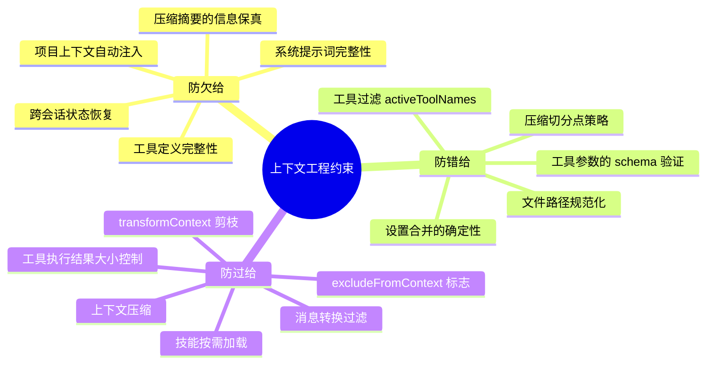
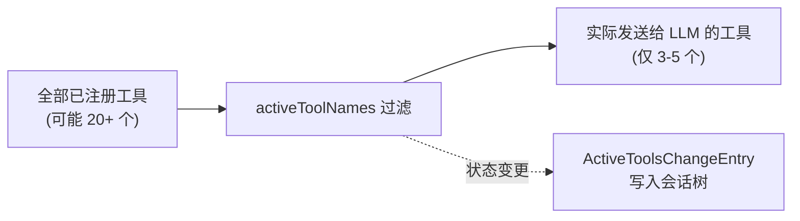
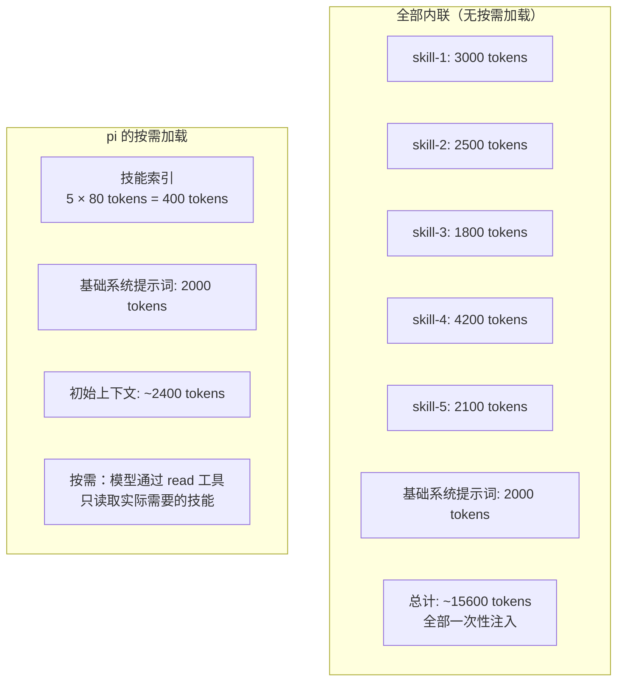
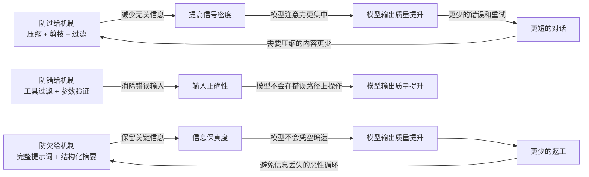

# 03 — 上下文工程约束机制

> **核心问题**：pi 通过哪些机制防止"欠给"、"错给"和"过给"？三维约束如何协同？

---

## 文档地图

| 编号 | 文档 | 定位 |
|------|------|------|
| [01](./01-概述与架构总览.md) | 概述与架构总览 | 全局视图、三层上下文工程挑战 |
| [02](./02-完整生命周期中的上下文构建.md) | 完整生命周期中的上下文构建 | 13 阶段流程、会话树、Compaction |
| **03** | **上下文工程约束机制** | **under/wrong/over-giving 三维约束** |
| [04](./04-上下文来源分类与稳定性约束.md) | 上下文来源分类与稳定性约束 | 三级来源模型、稳定性象限 |
| [05](./05-额外发现与深度洞察.md) | 额外发现与深度洞察 | 架构哲学、设计模式、极端场景 |

---

## 1. 三维约束总览

三种约束之间存在天然张力：压缩太多导致欠给，压缩太少导致过给。pi 的平衡点是将阈值暴露为可配置参数、将压缩内容强制结构化为固定模板、以及保留压缩点之后的原始消息。

---

## 2. 防欠给 (Under-giving Prevention)

> 欠给：模型获得的信息不足以完成任务 → 幻觉、跳过关键步骤、使用不存在的 API。

### 2.1 系统提示词的"基础保障层"

**策略**：系统提示词不仅包含角色定义，还强制注入当前日期、工作目录（cwd）、可用工具列表（含能力描述）、项目上下文文件内容、pi 文档路径引用。

**解决的问题**：模型缺乏运行时环境信息时只能依赖训练数据猜测，容易产生时间错误、路径错误。

**不这样做会怎样**：模型在被问"今天是什么日期"时给出训练截止日期；被要求"创建一个文件"时不知道创建到哪里——可能创建到 `/tmp` 或其他意外位置。

### 2.2 压缩摘要的强制信息结构

**策略**：压缩摘要不是自由格式，而是强制 LLM 生成固定 section 的结构化内容。

| Section | 防止什么信息丢失 |
|---------|----------------|
| Goal（目标） | 模型忘记"用户最初要做什么" |
| Constraints（约束） | 忘记项目特定限制（如"不要修改 schema 文件"） |
| Progress（进度） | 重复已完成工作或跳过未完成步骤 |
| Key Decisions（关键决策） | 后期做出与早期设计矛盾的选择 |
| Next Steps（下一步） | 会话恢复后不知道从哪里继续 |
| Critical Context（关键上下文） | 丢失"为什么选方案 A 而非方案 B"的推理链 |

**解决的问题**：结构化的 section 模板确保每一次压缩摘要的信息密度和覆盖范围一致。

**不这样做会怎样**：LLM 可能生成"用户要求实现认证功能，已完成部分工作"这种流畅但信息量为零的摘要——后续 LLM 不知道具体完成了什么、为什么这样选。

### 2.3 会话恢复的全态还原

**策略**：`buildSessionContext()` 在恢复会话时，不仅还原消息列表，还逐节点还原思维级别、当前模型、活跃工具列表。

**解决的问题**：用户为特定任务调整的代理状态（高思维级别、强模型、禁用不稳定工具）在会话恢复后保持。

**不这样做会怎样**：用户为复杂重构把 thinkingLevel 调到 "high"、换到更强的模型、禁用了 beta 工具——会话恢复后全部回默认值，推理质量下降，问题工具再次被调用并产生同样错误。

### 2.4 工具定义的完整性要求

**策略**：每个 AgentTool 必须提供 `name`、`description`、`parameters`（TypeBox schema）、`label`、`execute()`。description 的质量直接影响模型能否在正确时机选择正确工具。

**解决的问题**：欠给工具的 description 会直接导致模型选错工具或不选工具——这是最常见也最隐蔽的上下文工程失误。

**不这样做会怎样**：工具 description 过于笼统——模型在需要"创建 PostgreSQL 迁移脚本"时不知道有这个工具，转而用 bash 命令手动操作。

---

## 3. 防错给 (Wrong-giving Prevention)

> 错给：给模型的信息在技术上是错误的 → 过时的文件内容、不匹配的工具定义、错误的路径。

### 3.1 activeToolNames：运行时工具过滤

**策略**：`AgentContext.tools` 本身是可选的，且可通过 `activeToolNames` 进一步过滤。当设置时，只有列表中的工具出现在 LLM 上下文中。状态变更写入会话树的 `ActiveToolsChangeEntry`。

**解决的问题**：不同工作阶段只需要不同的工具集。进入"纯分析模式"时禁用 write 和 bash，模型知道"只能读不能写"，同时避免无关工具定义占用上下文 token。

**不这样做会怎样**：模型面对 20+ 个工具定义，在一轮只需读取文件的操作中可能"手滑"调用本不该在此阶段使用的工具，产生预期外副作用。

### 3.2 会话树来源追踪：SourceInfo

**策略**：加载技能、提示词模板等资源时携带 `SourceInfo`（source、scope、origin、baseDir）。任何时候都可以追溯"这条 prompt 片段来自哪个文件的哪一行"。

**解决的问题**：模型表现异常时快速定位是哪个上下文片段导致的问题。

**不这样做会怎样**：排查"模型为什么遵循了这条错误指令"时需要检查所有 50 个可能的源文件——SourceInfo 将排查从"遍历所有文件"缩短到"直接定位一个文件的一行"。

### 3.3 设置合并的确定性

**策略**：全局设置 → 项目设置的深度合并是确定性的——项目覆盖全局的同名字段。合并结果在任何时间点、任何实例上完全一致。

**解决的问题**：设置行为可预测、可复现。

**不这样做会怎样**：同一个项目的同一个会话，不同时间恢复后行为不一致——设置合并结果随机波动，压缩阈值、重试次数、工具可用性等关键参数变化。

### 3.4 压缩切分点策略：排除工具结果

**策略**：压缩时找到第一个有效切分点——用户消息、bash 执行消息、自定义消息、分支摘要或压缩摘要，但**排除工具结果消息**。

**解决的问题**：保持 (user → assistant → toolResult) 三连体的完整性。

**不这样做会怎样**：ToolResult 与触发它的 Assistant 消息分离——模型看到文件内容但不知道这是对"read file"的响应，丢失上下文关联。

### 3.5 工具参数的 schema 验证

**策略**：在 `beforeToolCall` 执行之前，`validateToolArguments(tool, preparedToolCall)` 验证模型生成的参数是否符合 TypeBox schema。不匹配的参数产生错误工具结果而非传入 `execute()`。

**解决的问题**：防止畸形参数或路径遍历攻击进入 `execute()` 函数。

**不这样做会怎样**：模型生成 `{ "path": "../../etc/passwd" }` 作为文件读取参数——schema 验证可以限制 path 参数必须匹配特定模式或不包含 `..`。

---

## 4. 防过给 (Over-giving Prevention)

> 过给：给模型的信息远超完成任务所需 → 注意力稀释、上下文窗口溢出、处理延迟增加。

### 4.1 技能按需加载：索引与内容分离

**策略**：技能在系统提示词中只占一个索引条目（name + description + location，约 50-100 tokens），完整内容通过 `read` 工具按需加载。

**解决的问题**：多个技能注册时不挤占上下文窗口。15 个技能可节省约 30,000+ tokens。

**不这样做会怎样**：系统提示词膨胀到占上下文 40%+，实际对话内容被截断，模型注意力稀释。

### 4.2 上下文压缩：替代而非附加

**策略**：用 LLM 生成的摘要替代原始消息——既不是简单截断（导致欠给），也不是无限堆积（导致过给）。

| 场景 | 压缩前 | 压缩后 | 节省 |
|------|--------|--------|------|
| 50 条消息的代码审查 | ~15,000 tokens | ~1,200 tokens（摘要） | ~92% |
| 100 条消息的调试 | ~35,000 tokens | ~2,000 tokens（摘要） | ~94% |
| 200 条消息的复杂重构 | ~80,000 tokens | ~3,500 tokens（摘要+最近 20 条） | ~90% |

迭代压缩的额外收益：第二次压缩更新第一个摘要而非生成第二个独立摘要——防止"摘要堆积"。

### 4.3 transformContext 剪枝

**策略**：`transformContext` 是用户可定制的钩子，在 AgentMessage 级别操作。典型策略包括时间窗口剪枝、token 预算剪枝、类型感知剪枝（优先丢弃通知类消息）。pi 不内置具体策略，暴露钩子让应用层决策。

**解决的问题**：不同场景需要不同剪枝策略——一刀切的内置策略要么剪太多（欠给），要么剪太少（过给）。

**不这样做会怎样**：内置固定的"保留最近 N 条"策略——在需要更早上下文的长任务中丢失关键信息，在只需要即时上下文的短任务中保留冗余。

### 4.4 convertToLlm 中的过滤

**策略**：`convertToLlm` 不仅做类型转换，还过滤不进入 LLM 上下文的消息。

- BashExecutionMessage 的 `excludeFromContext`：`!!` 前缀的命令输出不进入上下文
- 不可转换的自定义消息：内部状态通知、UI 更新消息等在转换时丢弃

**解决的问题**：内部系统消息和用户"只看一眼"的命令不污染推理上下文。

### 4.5 工具执行结果的隐式约束

**策略**：工具结果作为 ToolResultMessage 追加到 messages 数组，在下一轮 transformContext 时接受剪枝。没有硬性的工具结果大小限制，但通过后续剪枝管道间接控制。

**解决的问题**：读取大文件或命令输出大量内容时，不会永久占据上下文。

---

## 5. 三维约束的协同效应

防过给和防欠给之间存在天然张力——压缩太多导致欠给，压缩太少导致过给。但三维约束整体形成正反馈循环：

**关键洞察**：防错给是防欠给和防过给的"润滑剂"——当输入本身是错的，无论给多给少都没有意义。三种约束协同后，好的输出导致更短的对话，更短的对话需要更少的压缩，更少的压缩减少信息丢失风险。

---

## 6. 约束机制的故障模式对照

| 机制 | 正常工作时 | 失效/缺失时 |
|------|-----------|------------|
| 技能按需加载 | 系统提示词精炼，技能按需获取 | 提示词膨胀，占上下文 40%+，后续消息被截断 |
| 压缩 + 结构化摘要 | 早期对话浓缩为有用摘要，模型记住关键决策 | 旧消息被简单截断，模型忘记"为什么这样做"，重复提问或矛盾决策 |
| activeToolNames 过滤 | 只暴露当前阶段需要的工具，选择准确 | 模型面对全部工具，错误选择概率随工具数量增加 |
| 工具参数 schema 验证 | 畸形参数被拦截，返回清晰错误 | 畸形参数传入 execute()，运行时崩溃或未定义行为 |
| 切分点策略（排除 toolResult） | 压缩后工具调用链完整可追踪 | 压缩点将 toolResult 与 assistant 消息分离，模型丢失上下文关联 |
| excludeFromContext 标志 | 用户静默执行查询，不污染上下文 | 每次 `ls` 或 `cat` 都占用上下文，累积挤占关键信息 |
| 会话状态全态还原 | 恢复后行为完全一致 | thinkingLevel 丢失 → 推理质量波动，禁用工具重新出现 |

---

*本文档基于 pi 项目源码分析生成，版本时间戳 2026-06-23。*
