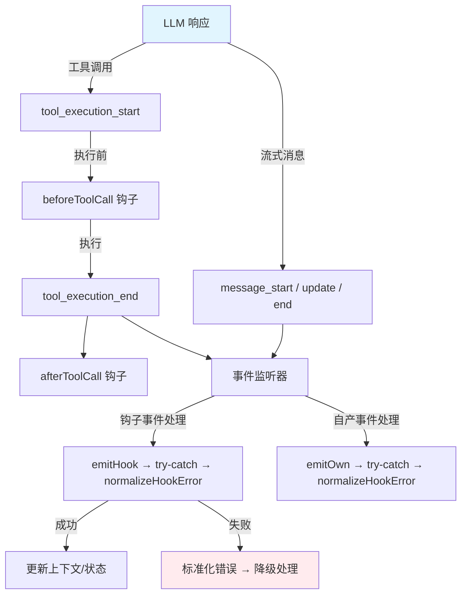
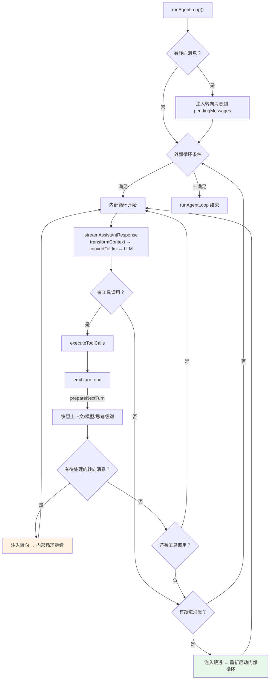
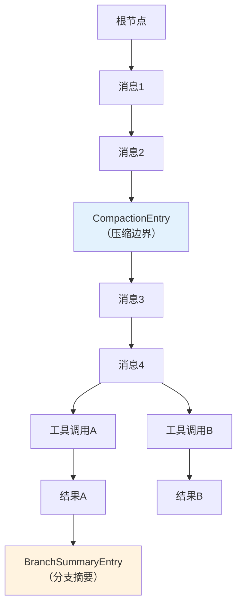

# pi 上下文工程策略分析 — 文档 5：额外发现与深度洞察

> 聚焦在三个强制维度（上下文构建、工程约束、来源分类）的分析过程中发现的、超出原定框架但仍具重要产品设计价值的模式与洞察。

---

## 文档地图

| 编号 | 文档 | 定位 |
|------|------|------|
| [01](./01-概述与架构总览.md) | 概述与架构总览 | 全局视图、三层上下文工程挑战 |
| [02](./02-完整生命周期中的上下文构建.md) | 完整生命周期中的上下文构建 | 13 阶段流程、会话树、Compaction |
| [03](./03-上下文工程约束机制.md) | 上下文工程约束机制 | under/wrong/over-giving 三维约束 |
| [04](./04-上下文来源分类与稳定性约束.md) | 上下文来源分类与稳定性约束 | 三级来源模型、稳定性象限 |
| **05** | **额外发现与深度洞察** | **架构哲学、设计模式、极端场景** |

---

## 总览：两个层次的结构

本文档的 19 条发现分为两层：

1. **架构机制层**（#1-#10）：类型系统扩展、钩子合约、事件系统、双队列、会话分支、模型热替换、设置迁移、重试机制、工具执行模式、工具动态过滤——这些是 pi 在上下文工程之下的骨架设计。
2. **设计哲学层**（#11）：从上述机制中提炼的更深层原则——分层套娃、Compaction 防火墙、技能双面性、excludeFromContext 的用户控制、设置并发安全、渐进式资源发现、Compaction 切点算法、StreamFn 合约、扩展系统的上下文拦截。

---

## 1. 类型系统的声明合并模式：可扩展的消息架构

**策略**：使用 TypeScript 的声明合并（Declaration Merging）构建可扩展的消息联合类型。核心包定义空接口 `CustomAgentMessages` + 联合别名 `AgentMessage`；中间件层（harness）通过 `declare module` 向该接口注入基础设施消息类型（BashExecutionMessage、CompactionSummaryMessage 等）；应用层（coding-agent）再次声明合并，确保完整的类型推断。每层只处理自己注入的消息类型。

**解决的问题**：如果不使用声明合并，每次添加新消息类型都需要修改核心包的联合类型定义。核心包频繁修改违背开闭原则（对扩展开放、对修改封闭），应用层无法独立添加消息类型，类型定义文件成为"合并冲突热点"。

**不这样做会怎样**：传统的显式联合类型（`type AgentMessage = Message | BashExecutionMessage | ...`）→ 核心包成为所有消息类型的"中央注册表"→ 任何新消息类型都需要改动核心包 → 插件系统和第三方扩展无法独立演进。

`convertToLlm` 函数使用 `switch-with-satisfies-never` 模式确保每种消息类型都有对应的 LLM 转换逻辑——如果新增消息类型但没有添加转换，TypeScript 编译器会报错。这是编译期安全性在类型系统中的体现。

---

## 2. "永不抛出"的钩子合约：韧性优先的工程哲学

**策略**：钩子函数绝不能抛出未捕获的异常导致代理循环崩溃。每条铁律在 4 个关键执行点落实：

- **事件分发**：`emitOwn/emitAny/emitHook` 以 try-catch 包裹每个监听器，错误经 `normalizeHookError` 标准化后向上传播（不静默吞没）。
- **beforeToolCall**：钩子中的错误被转换为 `ImmediateToolCallOutcome`（`isError: true`，content 为错误信息）。工具调用表面"成功"——结果正常追加到上下文，但 LLM 收到的工具结果是错误信息，可以据此调整行为。代理循环不中断。
- **工具执行**：`executePreparedToolCall` 的异常同样降级为 `{ content: String(error), isError: true }`，仍发射 `tool_execution_end` 事件，循环继续。
- **队列排出**：`drainQueuedMessages` 失败时，已取出的消息通过 `queue.unshift(...messages)` 退回队列头部，防止消息在错误路径中丢失。

**解决的问题**：在 AI Agent 中，上下文（对话历史、推理链）就是状态本身。崩溃意味着重建整个上下文，成本极高。钩子是第三方代码（扩展、应用层逻辑）的注入点——它们的行为不可信任。

**不这样做会怎样**：第三方钩子抛出异常 → 整个代理循环崩溃 → 用户看到白屏或未处理错误 → 所有对话上下文丢失。工具执行异常 → LLM 认为工具调用成功但实际失败 → 基于错误假设继续推理 → 上下文级联错误。这与 Erlang/OTP 的 "let it crash" 哲学相反——电信系统中状态是外部的，崩溃后重启即可；AI Agent 中上下文即状态，崩溃代价不可接受。

---

## 3. 事件系统作为一等公民：可观测性驱动的上下文调试

**策略**：事件系统是上下文构建过程的"审计日志"，而非简单的通知机制。双层架构：

- **底层 AgentEvent（10 种变体）**：agent_start → turn_start → message_start/update/end → tool_execution_start/update/end → turn_end → agent_end。每个事件携带完整状态快照——`tool_execution_start` 记录 LLM 决定调用什么工具和什么参数，`tool_execution_end` 记录工具实际返回了什么，`message_start/update/end` 记录 LLM 产出了什么（包括流式增量）。
- **上层 AgentHarnessOwnEvent（~12 种）**：queue_update、savepoint、abort、session_compact、model_update、thinking_level_update、active_tools_update 等。记录上下文被谁、在何时、因何原因修改。

**解决的问题**：没有事件系统时，调试上下文问题只能靠 console.log（侵入式、不可持久化）或检查最终 LLM 输入（只能看到结果，看不到构建过程）。事件系统提供了上下文变化的完整审计轨迹——如果 LLM 响应不符合预期，可以回溯事件日志定位哪个环节的上下文出了偏差。时序问题（如"工具结果还没返回但下一轮 LLM 调用已发出"）可以通过事件时间戳直接定位。

**不这样做会怎样**：上下文出问题时，开发者只能猜测哪个环节出错 → 排查时间成本高 → 复杂上下文 bug 几乎无法定位。这是"先建立观测能力，再构建核心功能"的思路，与 Google SRE 的"可观测性优先"原则一致。

---

## 4. 双队列架构：转向与跟进的精妙时机控制

**策略**：维护两个独立的消息注入队列——steering（转向，高优先级）和 follow-up（跟进，低优先级）。steering 在代理启动前和每个 turn_end 后立即注入；follow-up 仅当内部循环自然退出时注入。两条队列各支持 one-at-a-time（每次只取一条，等 LLM 处理后再取）和 all（一次性全部排出）两种注入模式。

**策略细节**：

| 维度 | Steering（转向） | Follow-up（跟进） |
|------|------------------|-------------------|
| 注入时机 | 急切：代理启动前 + 每个 turn_end 后 | 惰性：仅当内部循环自然退出时 |
| 注入位置 | 工具调用之间，LLM 调用之前 | 代理完成所有工具调用之后 |
| 语义 | "处理完当前工具后立即响应新指令" | "完成手头工作后，我还有一件事" |
| 对上下文的影响 | 可能在工具结果上下文不完整时注入 | 在完整工具上下文之后注入 |

**解决的问题**：这是并发编程中"优先级反转"问题在 AI 对话系统中的映射。如果只有一个队列，注入时机要么过于激进（打断推理链），要么过于保守（用户等太久）。转向队列相当于高优先级中断——在"工具调用完成后、下一轮 LLM 调用前"注入，这是最安全且最及时的注入点。跟进队列相当于低优先级任务——在当前工作自然结束后处理。

**不这样做会怎样**：过于激进 → LLM 在工具调用的推理链中间收到新指令，容易混淆上下文优先级。过于保守 → 用户在工具执行期间输入的内容被延迟处理，上下文中的时间戳错位。

---

## 5. 会话树分支：无损的对话探索

**策略**：会话历史不是线性的，而是一棵以 JSONL 格式持久化的树。每个节点通过 `id` 和 `parentId` 指针链接，支持在任何历史点分叉出新的对话路径。11 种条目类型（MessageEntry、CompactionEntry、BranchSummaryEntry、ActiveToolsChangeEntry、ModelChangeEntry、ThinkingLevelChangeEntry、ResourcesSnapshotEntry、SessionMetadataEntry、SavepointEntry、AbortEntry、TurnBoundaryEntry）覆盖了上下文的所有状态维度。

**分支操作 navigateTree()**：
1. 找到共同祖先（从当前叶子向上遍历）
2. 收集被放弃分支的条目
3. 可选地使用 LLM 将被放弃的条目压缩为 BranchSummaryEntry
4. 将 session 的 leafId 移动到新目标节点
5. 写入 BranchSummaryEntry 到被放弃分支的末尾

**上下文重建 buildSessionContext()**：从叶子节点反向向上遍历，遇到 CompactionEntry 时停止。复杂度为 O(分支深度) 而非 O(总条目数)。

**解决的问题**：用户可以无风险地进行"What If"探索——在任何历史点分叉，尝试不同的工具调用路径或指令，而不会破坏原始上下文链。被放弃的分支不会完全消失，而是被压缩为摘要存档。这受 Git 启发：`id/parentId` 相当于 commit hash/pointer，`navigateTree` 相当于 `git checkout`，`BranchSummaryEntry` 相当于 merge commit message。

**不这样做会怎样**：线性会话历史 → 用户无法尝试"如果我用另一个工具会怎样"→ 回退到历史点意味着永久丢失之后的所有上下文 → 实验性操作污染主对话线。对于 AI 辅助的复杂工作流（如代码重构），这种"可撤销、可分支"的对话模型是必需的。

---

## 6. prepareNextTurn：运行中模型/上下文热替换

**策略**：`prepareNextTurn` 钩子允许在 turn 之间完整替换当前上下文、模型和思考级别。执行流程：turn_end 事件发射 → `prepareNextTurn()` → 快照冻结当前状态 → 下一轮 LLM 调用。钩子从会话树重建完整状态——消息列表（通过 buildSessionContext）、当前模型（从 ModelChangeEntry）、思考级别（从 ThinkingLevelChangeEntry）、活跃工具列表（从 ActiveToolsChangeEntry）、资源（从 ResourcesSnapshotEntry）。

**解决的问题**：上下文的连续性与可变性如何共存？每一轮 LLM 需要看到完整的对话历史（连续性），但用户可能需要在中途调整上下文参数（可变性）。`prepareNextTurn` 通过"快照-冻结-替换"模式同时满足两者：历史消息不变（连续），配置参数在 turn 边界平滑切换（可变）。模型切换在下一轮无缝生效——不需要停止代理或重建上下文。

**不这样做会怎样**：切换模型 → 需要停止代理 → 重建上下文 → 重新开始 → 丢失推理链。增减工具 → 需要重启整个会话 → 无法在不中断工作流的情况下调整工具集。思考级别调整 → 只能在会话开始前设置 → 无法根据任务复杂度动态调整。

这体现了"边界模式"思想：状态变更只在明确的边界处（turn 之间）发生，边界内部的状态保持一致。将可变性限制在边界处，保证了每轮 LLM 调用看到确定性的上下文，同时提供了足够的灵活性。

---

## 7. 设置迁移系统：向后兼容的静默升级

**策略**：代理启动时自动运行一套幂等的迁移流程（`runMigrations`），将旧版本的设置文件、会话格式、工具布局等静默升级到最新格式。每个迁移遵循统一模式：检查目标位置是否已存在（是则退出，保证幂等）→ 从旧位置读取数据 → 写入新位置（含格式转换）→ 清理旧文件（可选）。

**迁移列表**：

| 迁移名称 | 功能 | 旧位置 → 新位置 |
|----------|------|-----------------|
| migrateAuthToAuthJson | 统一认证存储 | oauth.json + settings.json.apiKeys → auth.json |
| migrateSessionsFromAgentRoot | 会话文件迁移 | agent 根目录 *.jsonl → sessions/<cwd>/ |
| migrateCommandsToPrompts | 目录重命名 | commands/ → prompts/ |
| migrateToolsToBin | 二进制文件迁移 | tools/ → bin/ |
| migrateKeybindingsConfigFile | 配置格式迁移 | 旧格式 → 新格式 |

认证迁移中包含去重逻辑：从 oauth.json 和 settings.json 分别读取凭据，合并时检查重复（相同 key 只保留一个）。

**解决的问题**：上下文构建代码只需要读取当前格式的设置文件，不需要处理旧格式的兼容性分支。会话文件的路径迁移确保历史上下文不丢失——如果路径变了但迁移未执行，`buildSessionContext` 找不到历史数据，LLM 在"失忆"状态下工作。向后兼容意味着用户升级后不会丢失任何配置或对话。

**不这样做会怎样**：修改设置文件格式或存放位置 → 用户升级后所有旧设置丢失 → 默认设置被使用 → 上下文行为突变（如 compaction 参数变化）。历史会话无法加载 → LLM 丢失所有对话上下文 → 用户感觉 AI "不记得之前说过什么"。这是数据库 migration runner（如 Rails ActiveRecord Migrations）在桌面应用领域的移植——对于需要长期存储用户数据的 AI 应用，迁移系统是必备基础设施。

---

## 8. 重试机制：应用层的上下文感知韧性

**策略**：重试位于应用层（agent-session），与核心代理循环解耦。流程：代理运行返回错误 → `_handlePostAgentRun()` → 检查是否为可重试错误 → 计算指数退避延迟（baseDelay × 2^(attempt-1)）→ 从 agent 状态中移除错误消息 → 等待延迟（支持中止）→ 调用 `agent.continue()` 重新启动。LLM 成功后重试计数器归零，避免"偶尔的网络波动用尽了整个会话的重试配额"。

**错误分类**：

| 可重试 | 不可重试 |
|--------|----------|
| 过载错误（overloaded） | 上下文溢出（由 compaction 处理，不重试） |
| 速率限制（rate limit, 429） | 账单/配额错误 |
| 5xx 服务端错误 | 认证错误 |
| 网络/连接错误 | 参数错误 |
| WebSocket 关闭 / 流式过早结束 | |
| HTTP/2 错误 / 超时 | |

**上下文溢出不重试的原因**：上下文溢出不是临时错误——重试不会改变上下文长度。pi 将其交给 compaction 机制处理：先压缩历史，再重试。这是一种"错误类型 → 处理策略"的映射设计。

**解决的问题**：将重试从基础设施层（HTTP 客户端库的 SDK 级重试）提升到应用层。HTTP 层的重试只能处理网络问题；应用层可以判断什么错误值得重试、重试前是否需要修改上下文（如先 compaction）。错误消息在重试时被移除——LLM 不会在新一轮调用中看到"上次调用失败了"，避免了将临时网络错误误解为任务本身的失败。

**不这样做会怎样**：没有错误分类 → 所有错误都重试（上下文溢出也重试，永无止境）或都不重试（临时网络错误也终止）。网络抖动 → 整个代理运行终止 → 用户需要手动重新输入 → 上下文重建。

---

## 9. 工具执行模式：上下文隔离度的设计权衡

**策略**：支持两种工具执行模式，直接影响工具结果如何进入 LLM 上下文。

**Sequential（顺序）模式**：for 循环依次执行每个工具调用 → 工具 N 的结果追加到上下文后，工具 N+1 的 prepareToolCall 才能访问到 → 工具可以观察前序工具的输出 → 上下文渐进式增长。

**Parallel（并行）模式**：前置飞行阶段（顺序验证参数）→ 执行阶段（Promise.all 并发，工具之间完全隔离）→ 发射阶段（顺序追加结果到上下文）。所有工具在同一个上下文快照上执行，上下文批量增长。

**Per-tool 覆盖**：如果任何一个工具声明了 `executionMode: "sequential"`，整个批次降级为顺序执行。

**不同场景的推荐模式**：

| 场景 | 推荐模式 | 原因 |
|------|----------|------|
| 依赖链（A → B → C） | Sequential | 后续工具需要前序结果 |
| 独立工具调用（读文件 + 列目录） | Parallel | 互不依赖，并行加速 |
| 工具行为可能冲突（读和写同一文件） | Sequential | 需要确定性的执行顺序 |
| GPU 密集型工具调用 | Parallel | 充分利用并发 |

**解决的问题**：直接关系到 wrong-giving 约束中的一个子问题——工具结果是否应该在正确的上下文中被消费？默认并行、按需降级——大多数工具调用是独立的（读文件、搜索代码），并行执行有显著性能收益。少数需要顺序依赖的场景（如写文件后再读文件），通过 per-tool 属性实现精确降级。

**不这样做会怎样**：只支持 Sequential → 独立工具调用无法并行 → 响应延迟增加 N 倍。只支持 Parallel → 依赖链被破坏 → 工具 B 在错误的上下文中执行 → wrong-giving。

---

## 10. activeToolNames 动态过滤：精确的上下文预算控制

**策略**：维护 `activeToolNames: string[]` 列表，在每次 LLM 调用前动态过滤工具集。完整链路：用户/代码调用 setActiveTools → validateToolNames（检查名称在注册表中存在）→ 写入 ActiveToolsChangeEntry 到会话树 → 发射 active_tools_update 事件 → prepareNextTurn → createTurnState 从会话树读取活跃工具名 → 运行时过滤 → 过滤后的工具列表进入 AgentContext.tools → convertToLlm → LLM 只能看到活跃工具。

工具过滤状态是会话持久化的一部分——关闭并重新打开会话后，之前的过滤设置仍然有效。

**解决的问题**：LLM 上下文中的工具定义占用大量 token。一个典型的工具定义（名称 + 描述 + JSON Schema 参数）可能占用 200-800 tokens。30 个工具全部发送 → 仅工具定义就可能消耗 15,000+ tokens。通过运行时过滤，只在 LLM 需要时发送相关工具（代码编辑阶段发送 edit/write/bash，研究阶段发送 read/grep/glob），上下文预算被精确分配到当前任务阶段需要的工具上。

这代表了"上下文预算的主动管理"哲学——不让 LLM 自己判断哪些工具可用（那会增加认知负担），而是由编排层根据当前任务状态动态调整。类似于操作系统的"权限最小化原则"——进程只获得完成任务所需的最小权限。

**不这样做会怎样**：所有已注册工具始终在上下文中 → 上下文预算被工具定义大量占用 → 可用于对话历史的 token 减少。LLM 看到大量不相关的工具 → 可能被诱惑调用不合适的工具 → wrong-giving。无法在不同任务阶段调整工具集 → "一刀切"的工具配置。

---

## 11. 更深层的设计智慧

前 10 条聚焦于具体机制，本章提炼跨越具体实现的设计哲学。

### 11.1 分层架构的"俄罗斯套娃"模式

pi 的三层架构不是简单的"上层调用下层"，而是每一层扩展下一层但不修改下一层的嵌套设计。Layer 1（agent-loop）是纯代理引擎：接收 AgentContext → 调用 LLM，无状态、无持久化、无重试，不知道 harness 或 agent-session 的存在。Layer 2（harness）通过声明合并扩展 Layer 1 的类型，将构造好的 AgentContext 注入 AgentLoop。Layer 3（agent-session）通过 AgentHarness 的公共 API 编排 harness，处理重试、compaction 编排、设置管理。

每一层可以独立测试（Layer 1 用 mock context）、独立演进（Layer 1 的循环逻辑改变不影响会话管理）、独立替换（新应用可替换 Layer 3）。扩展方式遵循开闭原则——Layer 2 通过声明合并扩展 Layer 1，不修改其源码。

### 11.2 CompactionEntry 作为 LLM 自建上下文的"防火墙"

一旦压缩完成并写入 CompactionEntry，压缩边界之前的原始消息在 `buildSessionContext` 中不可达。后续 LLM 调用只能看到压缩摘要，看不到原始细节。这构成了一个递归结构：LLM 不仅消费上下文，还参与决定上下文的内容。如果 LLM 在压缩时做出了错误取舍（丢失了关键信息），后续所有推理都建立在残缺的上下文之上——这就是文档 04 中讨论的"自强化偏差"风险。

### 11.3 disableModelInvocation：技能的双面性

Skill 有两个角色：作为知识源（LLM 推理时参考）和作为可执行能力（LLM 决定"调用"一个 Skill）。`disableModelInvocation` 标志控制第二个角色——当为 true 时，Skill 不出现在系统提示的可调用技能列表中，LLM 不知道它的存在，但 Skill 内容仍可通过文件系统被其他 Skill 或系统代码访问。这区分了"系统知道的技能"和"LLM 知道的技能"——LLM 不需要知道所有系统能力，只需要知道它被授权使用的。这是一种上下文中的信息分级。

### 11.4 excludeFromContext：用户意图的精确表达

用户在 bash 命令前加 `!!` 前缀，命令输出不进入 LLM 上下文，但仍保留在会话历史中。`convertToLlm` 检测 `BashExecutionMessage.excludeFromContext` 标志，为 true 时跳过该消息。使用场景：用户运行诊断命令（如 `!!cat .env`），需要看到输出但不想让 LLM 看到（可能包含敏感信息或大量噪音数据）。这给了用户对"LLM 看到什么"的精确控制，而不影响自身的回溯能力。

### 11.5 设置系统的并发安全设计

使用 `proper-lockfile` 库实现设置文件的并发安全访问，锁定重试次数设为 10 次。因为 pi 允许同一用户运行多个代理实例（如不同的终端窗口），当两个实例同时尝试修改全局设置时：实例 A 获取锁写入 → 实例 B 等待 → A 释放锁 → B 获取锁读取最新设置（包括 A 的修改）→ 合并自己的修改 → 写入。10 次重试提供足够的窗口处理正常竞争，同时避免无限等待。

### 11.6 资源加载的 root→cwd 渐进式发现

AGENTS.md 文件的加载路径从文件系统根目录向下到当前工作目录（`/ → /Users/ → /Users/cissie/ → .../cwd`）。越靠近 cwd 的文件优先级越高（后加载，deep merge 覆盖）。这允许在组织级别定义全局规范，在项目级别覆盖，在子项目级别进一步定制——不需要配置文件中声明"加载哪个 AGENTS.md"，文件系统层级结构自然表达了优先级。这是"约定优于配置"的设计。

### 11.7 Compaction 切点算法的深层考量

切点算法排除了 `toolResult` 类型消息（通常包含大量终端输出，不具有摘要价值），优先保留用户消息（用户意图永远是关键上下文）、助手推理消息（推理链是核心）、转向/跟进消息（结构消息定义对话骨架）。这反映了一个设计判断：上下文中最重要的不是数据量，而是信息结构——100 行终端输出不如 1 行用户指令有价值。

### 11.8 StreamFn 合约的极端可靠性要求

`StreamFn` 合约要求"绝不抛出或返回被拒绝的 Promise。如果底层传输失败，错误必须序列化到流数据结构本身"。流式输出中断 = 消息不完整 → LLM 推理链断裂 → 下一轮调用基于残缺上下文。StreamFn 的可靠性是上下文完整性的第一道防线——即使 HTTP/WebSocket 连接断开，也不能在类型层面表现为异常。

### 11.9 扩展系统的上下文拦截能力

扩展系统支持注册两种钩子来拦截和修改 LLM 请求的上下文：`before_provider_request`（修改请求参数，如 streamOptions、model）和 `before_provider_payload`（修改 payload 内容，包括系统 prompt + 消息列表）。多个扩展可以依次拦截和修改请求，最终发送给 LLM 的是经过多层处理后的上下文。这构成了一个可组合的上下文处理管道——"中间件"模式在 AI Agent 中的应用。

---

## 总结：从机制到哲学

贯穿 19 条洞察的主线：pi 的架构哲学是将 AI Agent 视为一个需要精心设计的分布式系统，而非简单的"调 API"脚本。

1. **韧性优先**。"永不抛出"合约、重试机制、StreamFn 合约——共同构成了一个即使部分组件失败也不崩溃的系统。
2. **可观测性内置**。事件系统不是后来添加的调试工具，而是架构的一等公民——先建立观测能力，再构建核心功能。
3. **渐进式复杂度**。声明合并、分层架构、root→cwd 资源发现——核心简单，扩展复杂。新手可以只用 Layer 1，专家可以深入 Layer 3。
4. **上下文即状态**。Compaction 防火墙、会话树持久化、`prepareNextTurn` 热替换——都建立在"在 AI Agent 系统中，上下文就是最关键的状态，需要像数据库一样精心管理"这个核心认知上。
5. **为用户保留逃生舱**。`excludeFromContext`、`disableModelInvocation`、per-tool `executionMode`——在自动化和用户控制之间，始终保留用户干预的通道。

这些设计智慧适用于任何需要构建生产级 AI Agent 系统的团队——无论技术栈如何。

---

*文档 05 完。全系列 5 篇分析文档至此完成。*
